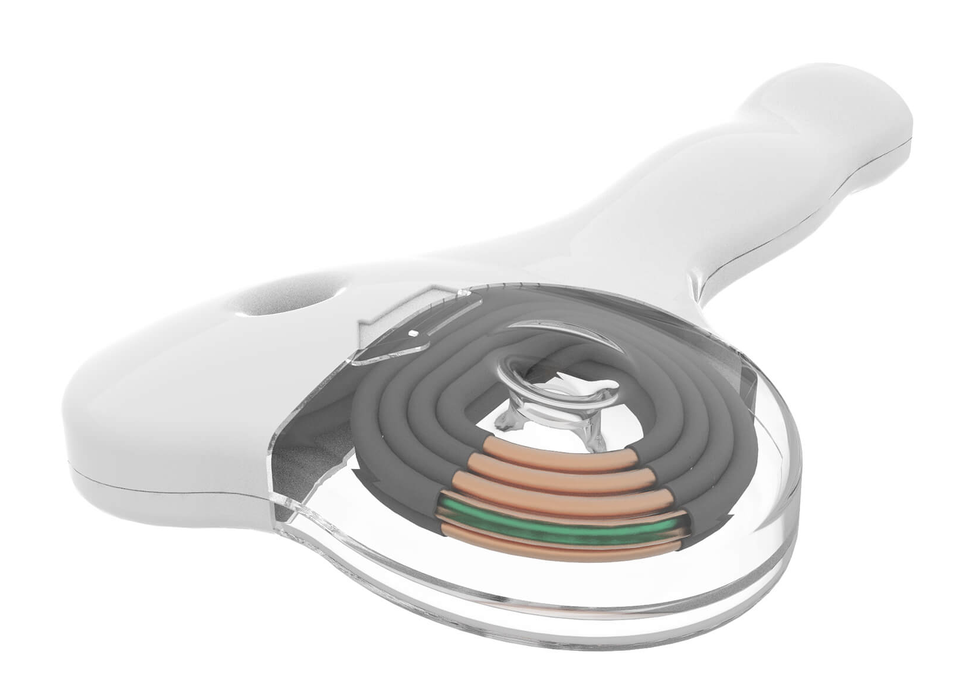
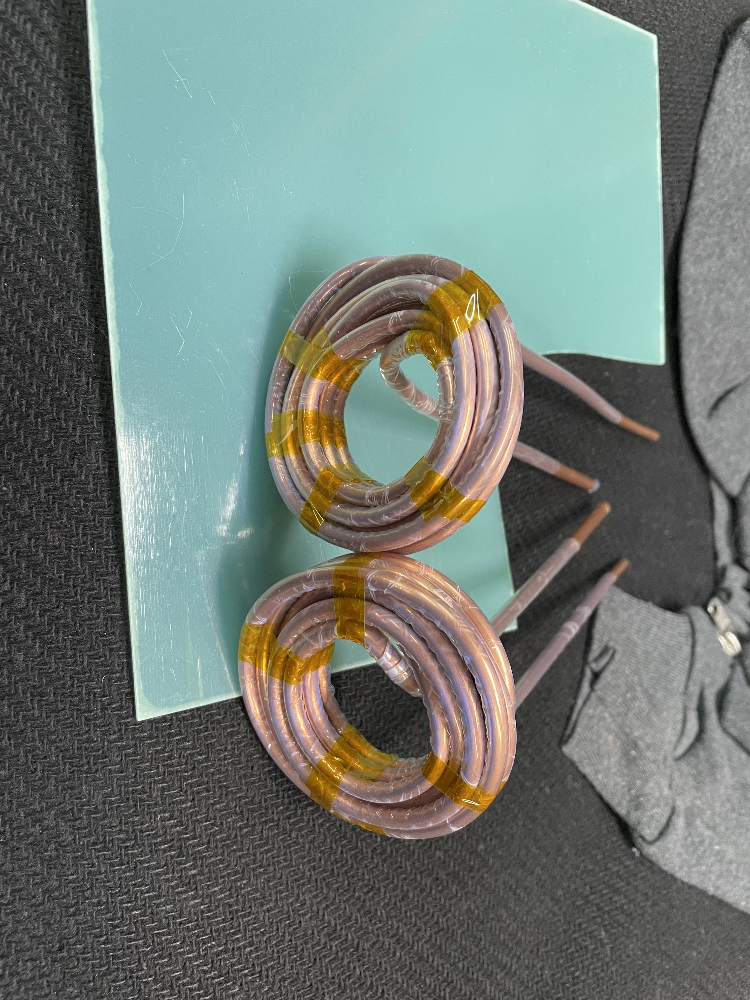
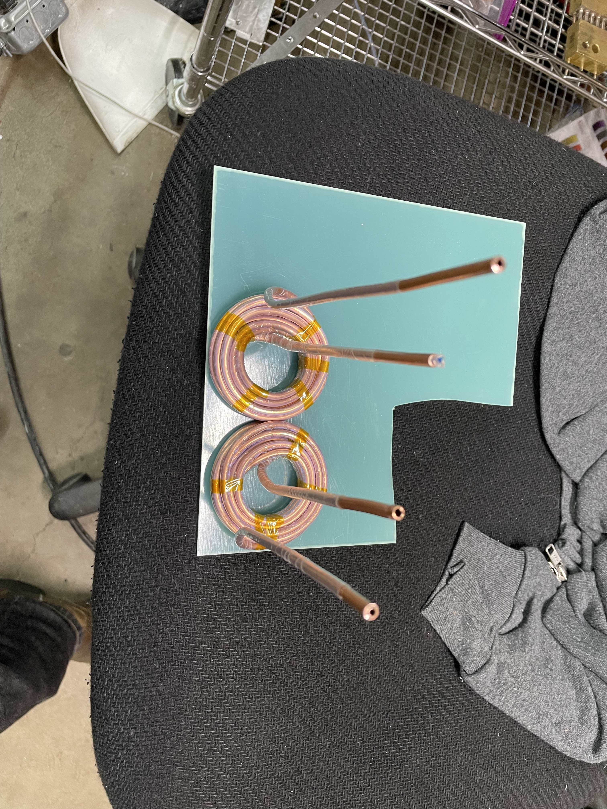
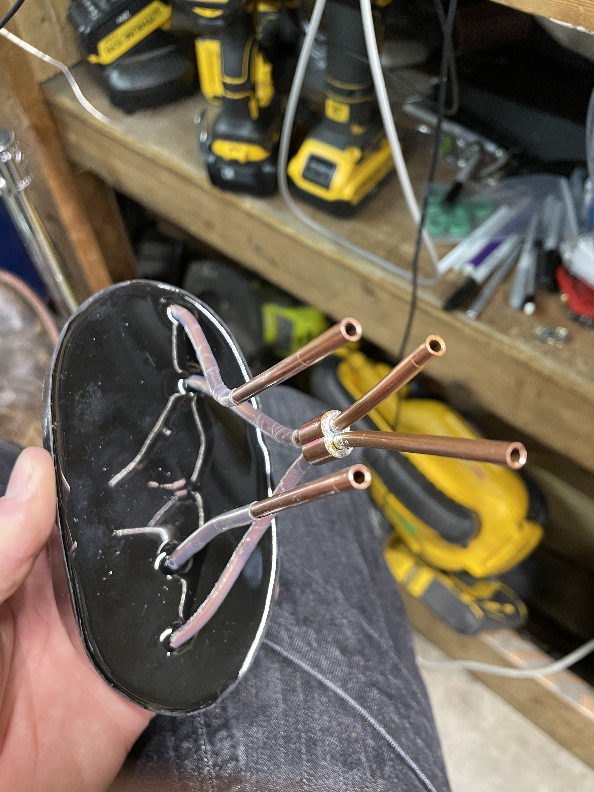

# Open-Source Transcranial Magnetic Stimulator

An open-source transcranial magnetic stimulator (TMS) project, including coil designs, pulse-generator hardware, and control/charging circuitry.

> **Safety Notice**
> This is **not** a legitimate medical device and is not a substitute for real TMS treatment. This is an experiment I built in my garage, and I cannot verify that it does what it's supposed to (if anyone wants to build an open-source MRI.... let me know...) This device is dangerous, it operates at energy levels more than enough to stop your heart, kill you, blow up and do lots of damage. If you're going to play with high energy pulsed power systems; be careful.

## Table of Contents
- [TMS Coils](#tms-coils)
- [Coil Cooling](#coil-cooling)
- [Coil Materials](#coil-materials)
- [IGBT Switches](#igbt-switches)
- [Gate Drivers](#gate-drivers)
- [Measurement System](#measurement-system)
- [Charging Circuit](#charging-circuit)
- [Pulse-Generator Designs](#pulse-generator-designs)
- [Charge-Control Circuit (In Progress)](#charge-control-circuit-in-progress)
- [Useful Resources](#useful-resources)
- [TODO](#todo)

---

## TMS Coils

I primarily build two coil geometries — single coils and figure-8 coils. What I've focused on are air-core windings in either single-layer or multi-layer form. The general architecture is adapted from research papers and the limited information published by commercial TMS coil manufacturers. The figure-8 CloudTMS coil (below) was a major influence on my designs in terms of hollow copper conductor carrying coolant.

As I moved to higher pulse rates and energies, active cooling became necessary. My preferred approach, similar to the CloudTMS design, uses hollow copper tubing (sold for HVAC/refrigeration) insulated with PTFE heat-shrink. PTFE works well because it's a good dielectric, stays thin-walled after shrinking, tolerates high temperatures, and holds the coil shape better than thicker heat-shrink alternatives — though it does require fairly high heat to shrink fully.

**Build process:**
- Source 4mm OD / 3mm ID copper tube (5m sections) and 4.5mm, 4:1 PTFE heat-shrink in bulk.
- Feeding heat-shrink onto a long tube run takes patience — compressed air, used to create an air cushion between tube and shrink-wrap, makes this much easier.
- Wind the coil on a custom jig, either single-layer or multi-layer (multi-layer here just means winding randomly around a bobbin rather than stacking discrete single-layer coils).
- Insert something into the copper tube close to the tube's ID (weed-wacker cable works well) during the first few windings to prevent the tube from collapsing, then remove it once winding is complete.
- Hold the coil together with tape ahead of potting.

  
  

<em>Example coil before potting</em>

Potting the coil in epoxy significantly improves mechanical stability and reduces noise by keeping the windings from moving against each other under pulse forces. Hot glue works as an alternative but produces coils that are noticeably louder in operation — not confidence-inspiring at higher power levels.

<em>Example coil after potting</em>

## Coil Cooling

Coils built from hollow copper tube are cooled by pumping coolant through the winding itself.

- **Mineral oil:** Used for a long time — thinner than typical oils but thicker than water. Maintaining ~40°C required roughly 150–200 psi to push enough flow through the coil's small ID. At higher energy levels, I added a water chiller and heat exchanger to pre-cool the oil.
- **Distilled water:** More recently, I've switched to distilled water paired with a diaphragm pump, since the diaphragm provides a degree of electrical isolation between the pump mechanism and the fluid. This is simpler and more effective overall, though there is still a risk of the coolant loop reaching high voltage.

## Coil Materials

| Material | Purpose | Notes |
|---|---|---|
| [Hollow copper tube](https://www.amazon.com/dp/B082FDVNC5) | Water-cooled coil winding | Standard refrigeration-grade tube; cheap and widely available |
| [Fiberglass resin sheet](https://www.amazon.com/dp/B0DYT28W8W) | Application-side coil face | Sturdy, good electrical insulator, and appears permeable to magnetic fields — a disassembled commercial coil used what looked like FR4 fiberglass (PCB-grade) |
| [MAX EPC epoxy potting compound](https://www.amazon.com/dp/B07PMTMKZQ) | Coil potting | Inexpensive, good electrical insulator, decent thermal conductivity. For tube-cooled coils, MAX MCR (lower thermal conductivity) is also an option |

---

## IGBT Switches

My current switch of choice is the **Infineon/Eupec FZ1200R33KF2** — inexpensive and capable of handling substantial power. Prices on eBay range from ~$100–$400, and I've pushed 8kA pulses through a single unit. Adequate snubber capacitance/circuitry is essential to keep the voltage across the device under its 3.3kV rating (I target a safety margin below that).

## Gate Drivers

I've used two Power Integrations gate drivers with this IGBT:

- **2SC0535T2G0-33** — Functional, but lacks features like active clamping to protect against turn-off voltage spikes. Requires a custom PCB with gate turn-on/turn-off resistors and capacitors.
- **1SD418F2-FZ1200R33KF2** — Purpose-built for the FZ1200R33KF2; bolts directly onto the device pads. Requires only a 15VDC supply (I use a 1A source). It communicates over two fiber-optic channels (input signal and output/status), which I drive with custom PCBs using AFBR-1624Z HFBR transmitter/receiver modules, controlled by a Teensy 4.1 through a 3.3V→5V level shifter.

---

## Measurement System

### Differential Voltage Measurement
Monitoring Vce (collector-emitter voltage) across each IGBT is critical to staying within its rating — I keep a safety margin and stay below 2.5kV on 3.3kV-rated devices. Since these switches operate on the high side, measurement requires a high-voltage differential probe: I use a **Micsig DP20003** (5600V, 100MHz). A similar, lower-range HV differential probe (1300V) monitors the main capacitor bank voltage.

### Current Measurement
A shunt resistor was my first attempt but never produced a trustworthy signal. Two methods have worked well since:

1. **Rogowski coil** — Excellent for high current measurement (AC or DC, no iron core to saturate), but calibrated probes are hard to find secondhand, and a calibrated integrator circuit is needed to get a usable scope signal. I use a calibrated coil from [PowertekUK](https://powertekuk.com) — specifically the [CWTMini](https://powertekuk.com/cwtmini).
2. **Current transformer (CT)** — I use a Tektronix A621 AC current probe (rated to 2kA, available on eBay for $100–$500). In practice, it agrees with the Powertek Rogowski coil up to roughly 8kA despite the rated limit.

---

## Charging Circuit

The charging circuit is a simple, open-loop design: mains power feeds a variable transformer (variac), which drives a microwave oven transformer (MOT) to step up voltage. The stepped-up AC is rectified by a full-bridge rectifier and used to charge the main discharge capacitor bank, which is then discharged through the coil via a high-side switch (latching SCR or non-latching IGBT).

### Microwave Oven Transformers
The current two-switch flyback pulse generator uses two matched MOTs (matched by checking voltage and phase agreement between units — *measurements/resources TODO*). Drawing ~15A at 120V, two matched transformers stay below ~60°C with air cooling alone.

Earlier designs used a single MOT with low-pressure mineral-oil cooling, which worked up to ~14A — but oil cooling systems and pumps added complexity and were prone to leaks.

---

## Pulse-Generator Designs

### Design #1 — SCR-Based Pulse Generator

<em>SCR-switch pulse generator (SCRs are bottom-right. Main capacitor front left. Rectifier behind capacitor. and mineral-oil cooled microwave transformer behid rectifier. </em>

The first design I built. It handles very high energy levels well at consistent frequencies/patterns (e.g., the standard 5Hz/10Hz protocols used in early depression-treatment research). Its limitation is pattern flexibility: an SCR/thyristor is a latching switchable diode, so once triggered it fully discharges the capacitor. This steady current decay is gentle on flyback effects but rules out more complex patterns like Theta-Burst (50Hz bursts repeating at 4–5Hz).

### Design #2 — Single-IGBT Pulse Generator

<em>Single IGBT topology (note; two IGBTs in parallel), you can also see gate driver I used before using ones built specifically for the IGBT module</em>

Since IGBTs aren't latching, they can be switched on and back off within a short pulse, allowing partial capacitor discharge and enabling patterns like Theta-Burst. The tradeoff is significant flyback voltage when interrupting current through the coil — this destroyed several IGBTs before I addressed it with a robust flyback diode across the coil and snubber capacitors across the IGBT(s) to absorb spikes from parasitic wiring/busbar inductance. HV differential probes are essential here to stay within the switch's voltage rating while tuning.

This design uses a flyback diode across the coil, producing a sharp current rise but a slow fall (as flyback energy dissipates through coil/wire resistance and the diode). It worked well and was relatively simple compared to the two-switch flyback design, but since flyback energy isn't recycled, it's ultimately limited by the 120V/15A charging circuit.

### Design #3 — Two-Switch Flyback IGBT Pulse Generator

<em>Two-Switch flyback topology being built. You can see the diodes hanging off to the sides. And gate drives are now on the left, bolted to IGBT modules behind bus-bars.</em>

This design recycles more pulse energy than the single-IGBT version and produces both a sharp rising *and* falling current edge, increasing di/dt for a stronger but shorter magnetic field pulse. It noticeably reduced charging-circuit current draw and appears more effective at stimulating muscle/nerve tissue than the single-switch design, even at higher peak current — likely because faster field transitions induce greater current in tissue.
+ For this design it's important to thermally bond both IGBT/switch modules so that they're the same temperature and have the same switching characteristics. For this I bolt them each to opposite sides of an aluminum plate which I attach water-cooling blocks to.
I've been realizing the importance of keeping switching loops tight, and have shortened cabling from capacitor to IGBTs, and shortening cables from IGBTs to diodes.

### Design #4 — H-Bridge IGBT Pulse Generator (Not Yet Built)
Should double coil pulse current relative to the two-switch flyback topology by enabling current reversal. The complexity of positioning four large IGBT switches and the associated snubbers and diodes close to eachother, with cooling is going to be difficult without adding parasitic inductance that would offset the gains.

---

## Charge-Control Circuit (In Progress)

I'm developing an improved, safety-critical charge-control circuit (KiCad schematics included in this repo) to replace an earlier Arduino/ADC-based version that couldn't sample the divided capacitor voltage reliably enough.

The new approach uses a DAC to output a reference voltage into a comparator, which compares it against the voltage-divided capacitor voltage. This removes the need for the microcontroller (Arduino/Teensy) to sample quickly or on a consistent schedule. A weak pull-down on the DAC output ensures that if the microcontroller glitches or crashes, the DAC voltage falls to zero and the charge circuit fails safely.

**Status:** The circuit has been built and the comparator triggers as expected, but the voltage-divider signal is picking up significant noise — unsurprising, given the system is essentially a small EMP generator. I've tried shielded cabling and filtering to clean up the signal, without much success. 

I've also tried doing the digital route; having the teensy read an H.V. isolated ADC (ADC going through SPI isolator). 
+ Pros; I can perform digital filtering (take multiple samples and average them to get rid of the peaks.)
+ Cons; this works intermittently, but I'm seeing issues where the voltage read by the ADC jumps to 1/2 of what the actual voltage is. This is not good. I'm trying find the issue and come up with a robust way to solve this (looking into different SPI modes to trigger on rising vs falling edge to fix propogation delay from isolators).

If I can't solve these ADC glitches in a very robust way I might go back to the original DAC + comparator method, and just accept that the comparator will flutter with the switching noise.

---

## Useful Resources
- [Coil placement and the 10-20 system/beam protocol (video)](https://youtu.be/CKCvAkgdJuY?si=f4i1zZF6m_ImrpPf)

## TODO
1. **Finish the charge-control circuit.** Comparator-based design comparing a DAC reference to capacitor voltage, so a hung/glitched microcontroller causes the DAC to fall to 0 and shut off charging.
2. **Build a phase-control rectifier** to replace the HV charge circuit's current rectifier and eliminate the variac, integrating it into the charge system. May need PID-style control of phase/firing angle — or a simpler bang-bang control scheme.
3. **Process gate-driver fault feedback** (via fiber-optic RX) to detect missed pulses. Response strategy TBD — possibly tripping a redundant switch to cut the charge circuit, and/or crowbarring the capacitor bank.
